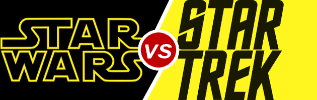

# Self-Identified Geekiness: How is that related to Star Wars or Star Trek fandom?
This project is investigating the influence of self-identified geekiness on Star Trek and Star Wars fandom.

[](https://creativecommons.org/licenses/by/4.0/)
[](https://opensource.org/licenses/MIT)
[](https://cran.r-project.org/)

<h5 align="center">
  <br>
</a>
<br>
</h5>


<h5 align="center">
Created by</a></h5>

<h4 align="center">

Amy Goldlist &nbsp;&middot;&nbsp;
Maud Boucherit &nbsp;&middot;&nbsp;
Tyler Roberts
</a></h4>

## Description

The survey that we used to collect data is located at [here](https://docs.google.com/forms/d/e/1FAIpQLSeqOI6W16UiiSh5LFngb5gjdM1ZHqsQ4zXytjOKEWQunqeUjA/viewform?usp=sf_link).  If you would like to jump straight to the report, [go right ahead!](doc/report.md).  

## Summary
The series "Star Wars" and "Star Trek" attract a lot of comparisons, possibly because they both start with the word "Star".  In our personal experience, we feel that the geekier a person identifies as, the more strongly they feel about this question.  In order to explore this, we created a survey to gather data about the subject that we can then analyse.  After looking at the data, we explored a model that we like to call the "rare disease" model, in which we posit that while preferring Star Trek is in the minority across all categories, being geekier increases the odds of choosing Star Trek over other alternatives.  We borrowed the methodology from statistical methods developed for studying relatively rare diseases, hence the name.  In this vein, we will use mosaic plots to explore the data and log odds ratios as an analytical tool.

### To run
All of the results are summarized in [our report](doc/report.md), but if you would like to run the analysis from top to bottom, we have included the following tools for maximum reproducibility.

#### With Make
To run the full analysis, clone the full repository, and from the root use the command:

```
make all
```

To delete all the files, use the command:

```
make clean
```

#### With Docker

To avoid any software dependency errors, you can pull the Docker image for this project, by running the command:


```
docker pull goldlist/geek_sw_vs_st

```

To run any of the scripts interactively, use
```
docker run --rm -it -v  C:\Path\to\cloned\repo:/home/geek_sw_vs_st goldlist/geek_sw_vs_st  /bin/bash
```

and navigate to the directory via `cd home\geek_sw_vs_st`.

To run the full script, use:
```
docker run --rm -it -v  C:\Path\to\cloned\repo:/home/geek_sw_vs_st goldlist/geek_sw_vs_st make -C 'home/geek_sw_vs_st' all
```

and to delete all of the new files:

```
docker run --rm -it -v  C:\Path\to\cloned\repo:/home/geek_sw_vs_st goldlist/geek_sw_vs_st make -C 'home/geek_sw_vs_st' clean
```

Make sure to replace `C:\Path\to\cloned\repo` with the path to the cloned repo on your own computer.  If you are working with Windows PowerShell, be sure to check the direction of your backslashes.

### Software Dependencies
The analysis was performed with R 3.4.2.  

##### R packages used
* tidyverse
* cowplot
* scales
* MASS
* nnet (only if running the additional scripts.)
* ezknitr


##### Other Tools
* make


## Contributing

[](http://makeapullrequest.com)

Feel free to help contribute code or other work to this project by first looking at our [contributing guidelines](CONTRIBUTING.md) and then submitting a pull request with your changes.

## License

This project is licensed under both the MIT license (for the code), and the Creative Commons license (for the reports).  If you would like to use any part of this work, please see our [license](LICENSE.md).
