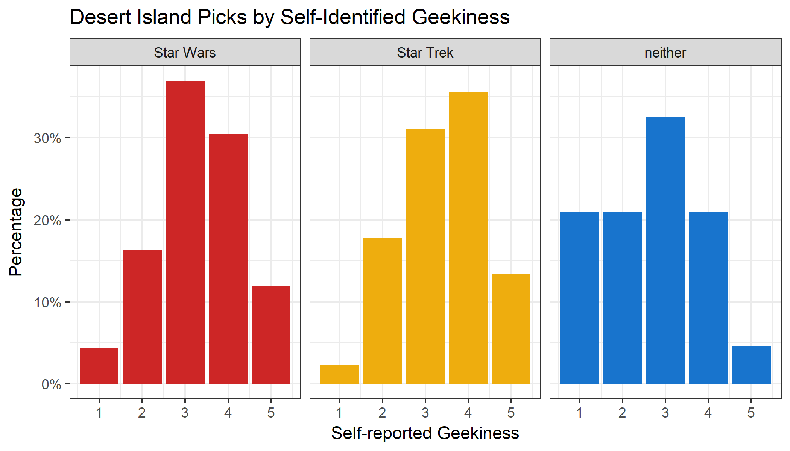

## Introduction

Our project seeks to explore the relationship between self-reported geekiness and a person's preference of Star Wars or Star Trek. 

## Methodology

We collected data using an [online survey](https://goo.gl/forms/Jb3pCN6GVhqziVvt1) asking users about their familiarity and knowledge of both series, as well as some basic demographic information, and how geeky they consider themselves. A more complete discussion of our project proposal and plans for analysis can be found [here](../proposal.md).  The key questions that we are using are:

##### The response variable: choice of series

> You're stuck on a deserted island, with a TV and only one complete set of movies/TV episodes/books/games to entertain you for the rest of your life.  Which do you choose?  
> * Star Trek
> * Star Wars
> * I choose neither.  I will stare at the sand for the rest of my life rather than choose a quality science fiction series to watch.

##### The explanatory variable: self-reported Geekiness

> How geeky would you rate yourself?
> * 1 (Not at all Geeky) to 5 (Super Geeky)

As well, we collected other data including:
* Familiarity with Star Wars, on a scale from 1 to 5
* Degree of knowledge about Star Wars, on a scale from 1 to 5:
  * For those who answered 5, an extra trivia question was included, to confirm their knowledge:
  > Who first uttered the line "It's a trap!" and in what film?
* Familiarity with Star Trek, on a scale from 1 to 5
* Degree of knowledge about Star Treks, on a scale from 1 to 5:
  * For those who answered 5, an extra trivia question was included, to confirm their knowledge:
  > According to Klingon mythology, what is the place where all life began?
* Overall familiarity: Star Trek, Star Wars, Neither or Both
* Age (in 10 year intervals to ensure anononymity)
* Gender
* Continent most identified with
* Job Sector
* Whether they are an MDS student

### Exploratory Data Analysis

If you would like to see the R analysis to produce there plots, please see [this Rscript](../src/image_ag.R).  As part of our analysis, we looked at relationships between our response and explanatory variables and various other responses.  Here are teh highlights of that analysis.  All of the analysis below is based on a sample of 174 respondants to our survey.  

#### Age and Desert Island Choice

The above figure breaks down each age group's choice of series. Since the 20-30 age group was by far the largest group of respondents to this survey, they dominate each of the three choices. That being said, they seem to make up fewer of those who would choose Star Trek, decreasing by roughly the same amount that the 30-40 group increased for this choice.

While the "Less than 20" group is one of the smallest, they have a larger than usual proportion among those who chose neither.

Finally, *nobody* among the 40-50 group chose to stare at the sand.

Given these results, we feel that it would be prudent to include age as a confounding variable in our analysis.
<\p>

#### Continent and Desert Island Choice

The above plot breaks down each continent's choice of series if they were stuck on a desert island.  Most people who chose Star Trek as their preferred series were located in North America, while Star Wars fans are highly concentrated in Europe relative to the other regions. Asia had the highest proportion of people who would prefer to stare at the sand for all eternity. 

When looking at these results, it is important to keep in mind that this plot does not capture the differences in total number of people who selected each series, so while most of the people who chose Star Trek identify as North Americans, the absolute number of these people is still lower than those from North America who chose Star Wars, and so on.

Given this effect, continent is another confounder that will be included in our analysis.
<\p>

#### Familiarity and Desert Island Choice

It makes intuitive sense that a person's familiarity with various series would influence their choice of series, and indeed it seems to be so.

An interesting result from the above plot is that very few people who are most familiar with Star Trek chose Star Wars as their desert island series, whereas a large number of those who were more familiar with Star Wars chose Star Trek. However, those who reported being equally familiar with both seemed evenly split between the two groups. 

Those who were not familiar with either series were mostly the ones who preferred to stare at the sand for eternity, and there were *zero* of those who were most familiar with Star Trek in that category.  Familiarity is another confounder which we choose to include in our analysis.

<\p>

#### Geekiness and Desert Island Choice

These plots show the distribution of self-identified geekiness facetted by the respondent's choice in series to have on a desert island.

Unsurprisingly, those who chose neither, who would prefer to stare out to sea or at patterns in the sand, generally rated themselves lower on the geekiness scale; with nearly 40% of such respondents rating themselves 1 or 2 out of 5, although the mode here appears to be a 3 as well. It is surprising that at least one person who rated themselves  5/5 in geekiness chose to watch neither of the series if stuck for eternity on a desert island.

Over 50% of those who chose Star Wars rated themselves a 3/5 on the geekiness scale although the distribution appears to be left skewed, with more people in this group rating themselves 4 than those rating themselves 2.

The mode for the Star Trek distribution was 4, unlike the other two groups. This might suggest that on average, people who prefer Star Trek are geekier, or at least consider themselves to be geeks more often. One way that we could formalize this more would be to measure the kurtosis in these distributions.

This is where we will focus our attention in our analysis, in explaining the differing shapes of these distributions.

<\p>

## Further Analysis 

Our main interest is in identifying the effect of self-identified geekiness to how much of a fan each participant is of Star Trek and Star Wars. We hypothesize that Star Trek will have a strong correlation with geekiness, whereas Star Wars will be more universal.

We also think that regardless of the above effect, participant's knowledge of the two series will strongly correlate with geekiness as well.

We plan to perform a series of hypothesis tests on the above effects, and perform a power analysis. Depending on the distribution of our data, we will determine which sort of hypothesis test is appropriate. We will correct our p-values using the Bonferroni correction, because we are not too concerned with the *type* of error we make, and so controlling FWER should be sufficient.

Finally, we are interested to see if geekiness correlates with a preference for a particular series. In order to test this we will try to fit some form of generalized linear model on a binary response (setting one series to 1 and the other to 0).  

We are interested in exploring if propensity score matching would be a good way to mitigate the effect of our confounding variables, particularly since we have uneven group sizes.
