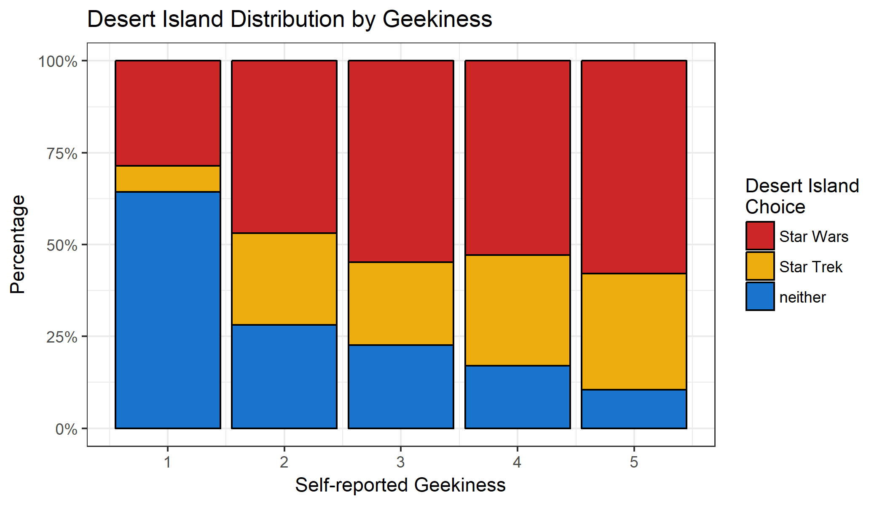
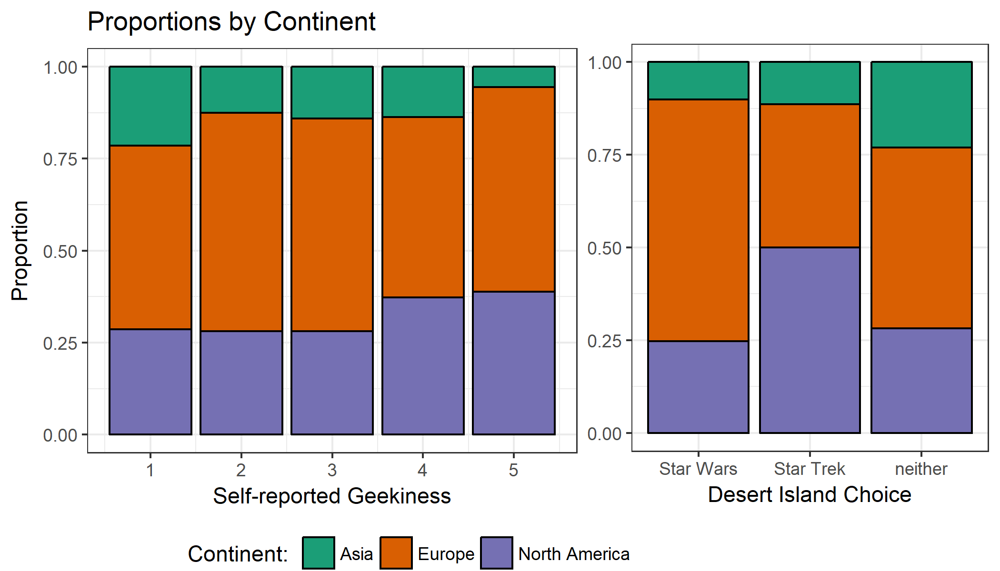
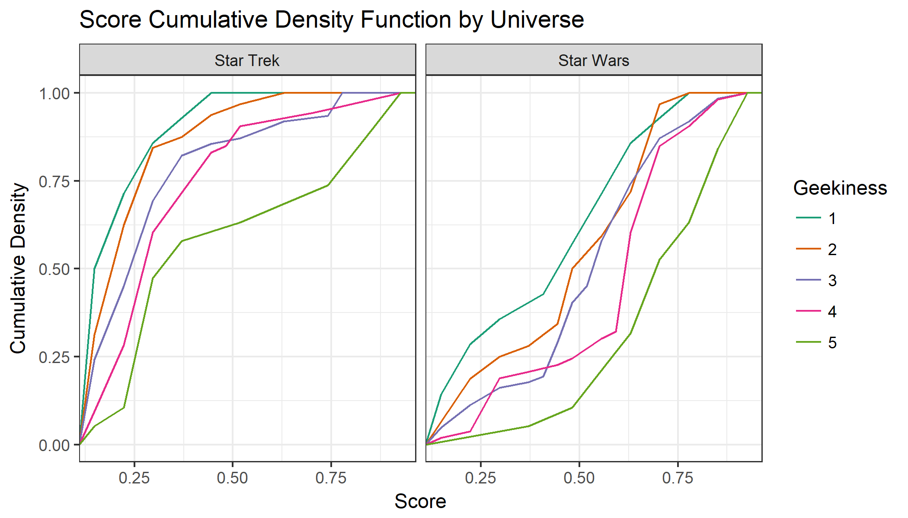
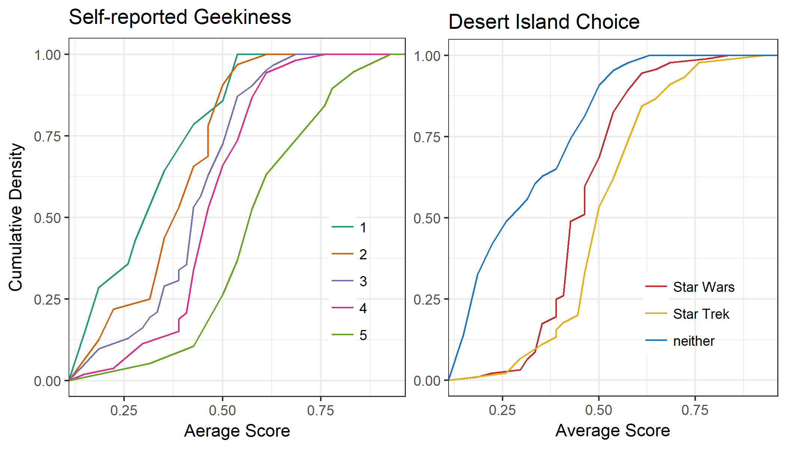

## Introduction

The series "Star Wars" and "Star Trek" attract a lot of comparisons, possibly because they both start with the word "Star".  In our personal experience, we feel that the geekier a person identifies as, the more strongly they feel about this question.  In order to explore this, we created a survey to gather data about the subject that we can then analyse.  After looking at the data, we explored a model that we like to call the "rare disease" model, in which we posit that while preferring Star Trek is in the minority across all categories, being geekier increases the odds of choosing Star Trek over other alternatives.  We borrowed the methodology from statistical methods developed for studying relatively rare diseases, hence the name.  In this vein, we will use mosaic plots to explore the data and log odds ratios as an analytical tool.

## Methodology

We collected data using an [online survey](https://goo.gl/forms/Jb3pCN6GVhqziVvt1) asking users about their familiarity and knowledge of both series, as well as some basic demographic information and how geeky they consider themselves.  The online nature was chosen for convenience, and as a criterion of this project's instructions.  We know that our method of choosing respondents is non-random, and we hoped that we would be able to compensate that in our analysis.

### Survey Study Design

The main question we were concerned with was whether a person's choice of Star Wars or Star Trek is correlated with their self-reported geekiness.  In order to tease out whether the choice has to do with how familiar they are with the series, we also asked respondents to rank their knowledge of the series' universe on a traditional Likert scale from 1 to 5.  We added a separate skill-testing question to differentiate if the knowledge's 5s were true experts.  Finally, the main response question asks respondents which series they would prefer if stuck on a desert island.  We call this their "desert island choice".

Our main explanatory variable is "Geekiness", and it was measured on a 5 point Likert scale.  We decided to omit a definition of geekiness because we believe that people's intrinsic understanding of the term is inherently tied to how they rank themselves.  This was a deliberate choice because we have no objective way to truly assess people's level of geekiness. Therefore, we will refer to this variable as the "self-reported geekiness".  

In order to adjust for possible confounders introduced by the nature of the survey, we asked basic demographic questions such as age, gender, employment sector, continent, and whether they were an MDS student.  We chose 10-year ranges for the age to protect the anonymity of our respondents.  We deliberately asked for gender identification with many options, in order not to conform to outdated gender norms.  However, we did merge our results into "male", "female", and "other" for better analysis.  For location, we chose to ask about the continent they most identified with to allow people who have lived in multiple locations to decide which was most important to their identity.

Finally, we used humour in our questions to keep respondents engaged and forwarding the survey.  We understand that this is not everybody's preference, but we ended up with a significantly larger sample than we had planned (around 180 respondents vs an estimated 45).  We were able to gather data for a large variety of age ranges and continents.


### Data Collection Methods

We collected data by distributing an online survey.  We shared the survey through three main channels:

-  All UBC MDS students completed the survey during the designated class time

-  We sent the survey to all Ensai (National School of Statistics and Data Analysis) students.  Since this program is in France, we hoped to get a more multicultural sample.

-  We posted it on Facebook and let Facebook's algorithm share as it would.  In order to get it to the top of Facebook feeds, we attempted to game their algorithm using the following text: "She said yes! It's twins!!! Here's one little trick, Congrats!! (now that I've hopefully gamed the algorithm enough to get to the top of your feed). Feel like filling out a survey? I promise not to steal your data, and you'd be having fun and helping me with a project."  

This method of sampling falls squarely under the header of "convenience sampling", and our sample is skewed towards the tech community.  

### Aspects of Ethics

After reading the UBC ethics code, we felt that our survey has no sensitive information, and we did not ask any personally identifying questions.  To this end, we had the respondent choose from 10-year ranges for their age.  Because of this, we feel confident enough to use Google forms as a vehicle.  As per UBC policy, we had a paragraph (copied verbatim from the UBC page for legal reasons) informing the respondent that the information will be stored in a US server subject to homeland security, and have them click to acknowledge this:

> "This online survey company is hosted by a web survey company located in the USA (Google) and as such is subject to U.S. laws, in particular, the US Patriot Act which allows authorities access to the records of internet service providers. If you choose to participate in the survey, you understand that your responses to the survey questions will be stored and accessed in the USA. The security and privacy policy for Google can be found at the following link: https://policies.google.com/"


### The Survey

Below is the complete survey, including the images we displayed:

#### Self-Identified Geekiness
- How would you rate your degree of geekiness?
    - From (1) not geeky at all to (5) super geeky

#### Star Wars-related


- How would you rate your degree of fandom?
    - From (1) I hate it! to (5) I even love the prequels!
- How would you rate your degree of knowledge about the Star Wars universe?
    - From (1) no knowledge at all to (5) expert knowledge
    - If rated 5: People are redirected to a difficult question about Star Wars:
        > Who first uttered the line "It's a trap!" and in what film?

#### Star Trek-related


- How would you rate your degree of fandom?
    - From (1) I hate it! to (5) I even love Wrath of Khan!
- How would you rate your degree of knowledge about the Star Trek universe?
    - From (1) no knowledge at all to (5) expert knowledge
    - If rated 5: People are redirected to a difficult question about Star Trek:
        > According to Klingon mythology, what is the place where all life began?

#### Star Wars Vs. Star Trek


- Overall, are you more familiar with Star Wars or Star Trek universe?
    - Answers are: Star Wars, Star Trek, Both, Neither
- You're stuck on a deserted island, with a TV and only one complete set of movies/TV episodes/books/games to entertain you for the rest of your life.  Which do you choose?
    - Answers are: Star Wars, Star Trek, Neither: I will stare at the sand for the rest of my life rather than choose a quality science fiction series to watch.

#### Confounding Variables
- What is your age?
    - Below 20, In my 20s, In my 30s, In my 40s, 50 or older
- What is your gender?
    - Female, Male, Non-binary, Prefer not to say, Other…
- Which continent would you identify yourself with?
    - North America, South America, Asia, Europe, Africa, Oceania, Antarctica
- What is the main sector of your job/education background?
    - Tech, Finance/Economics/Business, A, ministration/Education, Biology/Medicine, Chemistry/Physics, Math/Statistics, Other…
- Are you currently enrolled in the MDS program at UBC?


### Analysis Methods 

The raw survey data can be found [here](../data/Geekiness_Survey.csv).  In order to prepare the data for analysis, we cleaned the data.  If you are interested in the R code, it can be found [here](../src/data_wrang.R).  The [final cleaned dataset](../results/clean_data.csv) is available as well. 

[**this is very rough and totally needs work**]
We decided to incorporate confounding variables gender, age, continent and sector of activity because we want to have information about who answered our survey so we can identify any possible bias in the sample.  [**Add more, probably**]

We planned to look at relationships between our response and explanatory variables and to model the effect of these confounding variables to decrease any bias. To do so, we want to stratify our survey's answers according to a propensity score. 

Methods we explored are logistic regressions, both binomial, ordinal and multinomial, and propensity score matching.

Since we were asking subjective questions, we chose to use Likert scales for many variables.  Dealing with Likert scales can be difficult as ordinal data can be both categorical or quantitative data depending on the analysis used.  In our research, we found that there is no clear consensus as to how to treat such data in the analysis.  In recent years, there have been more arguments in favour of using parametric methods to deal with ordinal data, particularly when several Likert scale questions are grouped to give a more balanced score.  To this end, we have aggregated several questions into one common score and used conventional methods to analyse the data.


**EXPAND THIS PART!!!**

## Analysis and Results 


### Exploratory Data Analysis

If you would like to see the R code to produce these plots, please see [this Rscript](../src/eda_plots.R).  As part of our analysis, we looked at relationships between our response and explanatory/confounding variables.  Here are some highlights of that analysis.  All of the analysis below is based on a sample of 180 respondents to our survey.  


#### Geekiness and Desert Island Choice

The focus of our analysis is the effect of geekiness on the variable we have called "Desert Island Choice".  


These plots show the distribution of self-identified geekiness faceted by the respondent's choice in series to have on a desert island.

Unsurprisingly, those who chose neither, and who would prefer to stare at patterns in the sand, generally rated themselves lower on the geekiness scale: nearly 40% of such respondents rated themselves 1 or 2 out of 5, although the mode is 3. It is surprising that at least one person who rated themselves  5/5 in geekiness chose to watch neither of the series if stuck for eternity on a desert island.

Over 35% of those who chose Star Wars rated themselves a 3/5 on the geekiness scale. The distribution seems to be left-skewed, with 15% more people in this group rating themselves 4 than those rating themselves 2.

The mode of the Star Trek distribution is 4, unlike the other two groups. This might suggest that on average people who prefer Star Trek are geekier or at least consider themselves to be geeks more often. We could formalise this by measuring the kurtosis in these distributions.

This is where we will focus our attention during our analysis, in explaining the differing shapes of these distributions.




As we can see on the above mosaic plot, the proportion of those choosing neither increases as the self-reported geekiness decreases. More than 60% of the people who self-reported a geekiness of 1 chose neither. It appears that the proportion of those choosing Star Trek increases with the geekiness. The proportion of people who prefer Star Trek among those who self-reported a geekiness of 1 is especially low. 


#### Age and Desert Island Choice

An important confounding variable is age.  As we can see from the mosaic plot below, there is a clear effect of age on both desert island choice and geekiness.


The above bar plots break down each level of geekiness and desert island choice by age group. Since the 20-30 age group is by far the largest group of respondents to this survey, they dominate each distribution. While the "Less than 20" group is one of the smallest, they have a larger than usual proportion among those who chose neither. But they tend to grade themselves as geeky (3) to really geeky (5). Except that, we can't really see any pattern in the age group distribution by geekiness. The relationship is not totally uniform, but it is not monotone either.

For the desert island choice, respondants choosing neithe are overall younger and those choosing Star Trek are older: 
- people below 30 count for 81% in the neither group, 73% for Star Wars and 45% for StarTrek,
- people above 40 count for 2% in the neither group, 9% for Star Wars and 18% for StarTrek.

Finally, *nobody* among the 40-50 group chose to stare at the sand.  Given these results, we feel that it is prudent to include age as a confounding variable in our analysis.


#### Continent and Desert Island Choice

When we looked at the continent, we found a clear trend that Star Trek is more popular in North America than in the other continents.  Our working theory is that Star Trek wasn't as exported to other continents than Star Wars.




The above bar plots break down each level of geekiness and desert island choice by continent. 

There appears to be an inverse correlation between being Asian, and being Geeky. On the contrary, the proportion of North Americans increases with the geekiness. So compared to Europeans, Asians are overall less geeky, and Northern Americans are overall geekier. 

Nearly 50% of the people who chose Star Trek as their preferred series were located in North America, while Star Wars fans are highly concentrated in Europe relative to the other regions. People who would prefer to stare at the sand for all eternity have the highest proportion of Asians. 

When looking at these results, it is important to keep in mind that this plot does not capture the differences in total number of people who selected each series. So while most of the people who chose Star Trek identify as North Americans, the absolute number of these people is still lower than those from North America who chose Star Wars, and so on. Given this effect, continent is another confounder that we included in our analysis.


#### Familiarity, knowledge and Desert Island Choice

In order to properly account for the level of fandom and knowledge, we created a new variable that encompasses each universe. In order to do this we created a "Star Trek Score" which is:

_Star Trek Score = [Star Trek Fandom level + Star Trek Knowledge level + 2.5(if familiar with Star Trek)]/12.5_

and a "Star Wars Score" im a similar fashion.  By doing this we hoped to negate some of the effects of having likert scales, and have more finely calibrated categories.  In the end we have a score out of 1 for each, which summarizes their interaction with the universe.

**[Add this:]** + 1(if got the extra trivia question) (If we add this)

***PREVIOUS COMMENT (some might be reusable)***
It makes intuitive sense that a person's familiarity with various series would influence their choice of series, and indeed it seems to be so.

An interesting result from the above plot is that very few people who are most familiar with Star Trek chose Star Wars as their desert island series, whereas a large number of those who were more familiar with Star Wars chose Star Trek. However, those who reported being equally familiar with both seemed evenly split between the two groups. 

Those who were not familiar with either series were mostly the ones who preferred to stare at the sand for eternity, and there were *zero* of those who were most familiar with Star Trek in that category.  Familiarity is another confounder which we choose to include in our analysis.


**Amy likes this first one best!**



Comment HERE !!!!




Comment HERE !!!


## Discussion of  Results


If you would like to see the code for any of the models in this section, please view the [Rmd file](../src/report.Rmd) for this report.  

We wanted to deal with our confounding variables outside of our main model, and so we used teh technique of Propensity Score Matching.  In this method, we first created a propensity model, which plots our main explanatory variable (Geekiness) against all of the confounders which we explored above.

After looking at various models, we chose a plain linear mode for our propensity scores.  Despite the fact that we have ordianl data, we found that by modeling it as a continuous variable, we got the most sensible results for analysis.  In this case, we are looking for a 


```r
## Create a linear model using our main explanatory variable agains the confounders.
propensity <- lm(geeky~ age+ familiar+continent+ sw_score + st_score, data =clean_data)
```


We note that non of the results from this analysis are especially significant, but the hope is that by including this term, we can account for some of the confounders introduced by the fact that we have an unbalanced dataset.


Now we use the (continuous) propensity scores as a factor in our analysis.  This model uses _propotional odds logistic regression (polr)_. We chose this model to take into account that there is an ordering to the desert island scores, with neither being the lowest, and Star Trek being the highest.  We  explored other methods, but in the end feel that ignoring the ordered nature of this variable lost too much data:  Below is the result of our model:


```
## Call:
## MASS::polr(formula = desert_island ~ geeky + propensity, data = clean_data, 
##     Hess = TRUE, method = "logistic")
## 
## Coefficients:
##              Value Std. Error t value
## geeky      0.01427     0.1598 0.08925
## propensity 1.68281     0.3408 4.93780
## 
## Intercepts:
##                     Value  Std. Error t value
## neither|Star Wars   4.0569 0.9222     4.3989 
## Star Wars|Star Trek 6.6834 1.0141     6.5902 
## 
## Residual Deviance: 332.7033 
## AIC: 340.7033 
## (1 observation deleted due to missingness)
```

#### Interpretation of these results

Becuase this is an multinomial distribution, we have two intercepts:  This is because a polr model is modeling the probability of going from one category to the next; that is, moving from "neither" to "Star Wars", and from "Star Wars" to "Star Trek."  Also note that we are modelling the _log odds ratio_, not the simple probability.


Looking at these results, it is clear that once we adjust for our confounding variables, there is not enough evidence to show that geekiness has an effect on choice of desert island viewing material. We can see that the log odds ratio increases by only 0.014 for every increase in geekiness. With a standard error of 0.1598, it is clear that there is no statistical result here. Most of the percieved effect from fitting a model just with geekiness scores is due to the confounding variables: 


```
## Call:
## MASS::polr(formula = desert_island ~ geeky, data = clean_data, 
##     Hess = TRUE, method = "logistic")
## 
## Coefficients:
##        Value Std. Error t value
## geeky 0.4241     0.1352   3.138
## 
## Intercepts:
##                     Value  Std. Error t value
## neither|Star Wars   0.1481 0.4444     0.3333 
## Star Wars|Star Trek 2.5090 0.4889     5.1318 
## 
## Residual Deviance: 361.3256 
## AIC: 367.3256
```
 Above see he results of fitting a polr model to the geekiness value, without accounting for the confounders.  In this model there seems to be an effect, but our analysis above shows that this is the result of confounding variables.
 
 
#### Conclusion to Anlaysis

By including confounding variables, we were not able to show a significant effect of geekiness on desert island choice.  


## Discussion of  Survey/Study Design

In our original survey, we did not leave a space for "the arts" or the underemployment sector.  As a result, we had a lot of write-in "other" categories, thus making analysis difficult. We also chose to narrow our focus to Star Trek vs Star Wars and not to include other science fiction series such as _Doctor Who_.  This did annoy some of our respondents who did not want to choose.  Also, some respondents felt that we should have dealt with the _geek_ vs _nerd_ dichotomy, which is not something we have an opinion on. But apparently, people do.

**expand**
