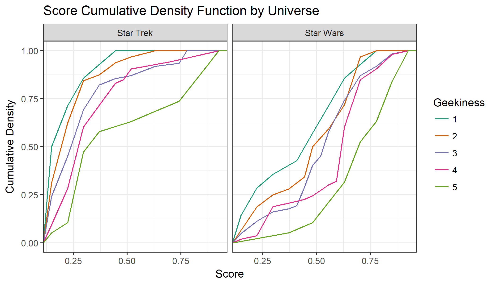
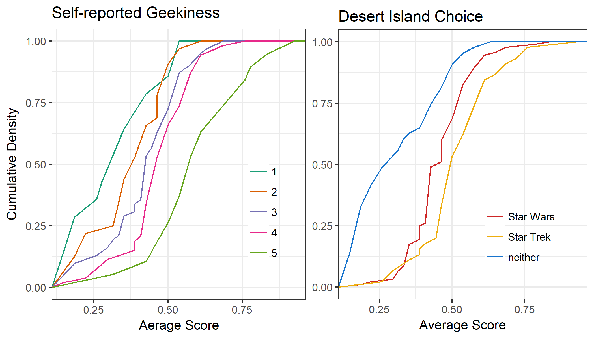

```{r setup, include=FALSE}
knitr::opts_chunk$set(echo = TRUE)

```

## Introduction

The series "Star Wars" and "Star Trek" attract a lot of comparisons, possibly because they both start with the word "Star".  In our personal experience, we feel that the geekier a person identifies as, the more strongly they feel about this question.  In order to explore this, we created a survey to gather data about the subject that we can then analyse.  After looking at the data, we explored a model that we like to call the "rare disease" model, in which we posit that while preferring Star Trek is in the minority across all categories, being geekier increases the odds of choosing Star Trek over other alternatives.  We borrowed the methodology from statistical methods developed for studying relatively rare diseases, hence the name.  In this vein, we will use mosaic plots to explore the data and log odds ratios as an analytical tool.

## Methodology

We collected data using an [online survey](https://goo.gl/forms/Jb3pCN6GVhqziVvt1) asking users about their familiarity and knowledge of both series, as well as some basic demographic information and how geeky they consider themselves.  The online nature was chosen for convenience, and as a criterion of this project's instructions.  We know that our method of choosing respondents is non-random, and we hoped that we would be able to compensate that in our analysis.

### Survey Study Design

The main question we were concerned with was whether a person's choice of Star Wars or Star Trek is correlated with their self-reported geekiness.  In order to tease out whether the choice has to do with how familiar they are with the series, we also asked respondents to rank their knowledge of the series' universe on a traditional Likert scale from 1 to 5.  We added a separate skill-testing question to differentiate if the knowledge's 5s were true experts.  Finally, the main response question asks respondents which series they would prefer if stuck on a desert island.  We call this their "desert island choice".

Our main explanatory variable is "Geekiness", and it was measured on a 5 point Likert scale.  We decided to omit a definition of geekiness because we believe that people's intrinsic understanding of the term is inherently tied to how they rank themselves.  This was a deliberate choice because we have no objective way to truly assess people's level of geekiness. Therefore, we will refer to this variable as the "self-reported geekiness".  

In order to adjust for possible confounders introduced by the nature of the survey, we asked basic demographic questions such as age, gender, employment sector, continent, and whether they were an MDS student.  We chose 10-year ranges for the age to protect the anonymity of our respondents.  We deliberately asked for gender identification with many options, in order not to conform to outdated gender norms.  However, we did merge our results into "male", "female", and "other" for better analysis.  For location, we chose to ask about the continent they most identified with to allow people who have lived in multiple locations to decide which was most important to their identity.

Finally, we used humour in our questions to keep respondents engaged and forwarding the survey.  We understand that this is not everybody's preference, but we ended up with a significantly larger sample than we had planned (around 180 respondents vs an estimated 45).  We were able to gather data for a large variety of age ranges and continents.


### Data Collection Methods

We collected data by distributing an online survey.  We shared the survey through three main channels:

-  All UBC MDS students completed the survey during the designated class time

-  We sent the survey to all Ensai (National School of Statistics and Data Analysis) students.  Since this program is in France, we hoped to get a more multicultural sample.

-  We posted it on Facebook and let Facebook's algorithm share as it would.  In order to get it to the top of Facebook feeds, we attempted to game their algorithm using the following text: "She said yes! It's twins!!! Here's one little trick, Congrats!! (now that I've hopefully gamed the algorithm enough to get to the top of your feed). Feel like filling out a survey? I promise not to steal your data, and you'd be having fun and helping me with a project."  

This method of sampling falls squarely under the header of "convenience sampling", and our sample is skewed towards the tech community.  

### Aspects of Ethics

After reading the UBC ethics code, we felt that our survey has no sensitive information, and we did not ask any personally identifying questions.  To this end, we had the respondent choose from 10-year ranges for their age.  Because of this, we feel confident enough to use Google forms as a vehicle.  As per UBC policy, we had a paragraph (copied verbatim from the UBC page for legal reasons) informing the respondent that the information will be stored in a US server subject to homeland security, and have them click to acknowledge this:

> "This online survey company is hosted by a web survey company located in the USA (Google) and as such is subject to U.S. laws, in particular, the US Patriot Act which allows authorities access to the records of internet service providers. If you choose to participate in the survey, you understand that your responses to the survey questions will be stored and accessed in the USA. The security and privacy policy for Google can be found at the following link: https://policies.google.com/"


### The Survey

Below is the complete survey, including the images we displayed:

#### Self-Identified Geekiness
- How would you rate your degree of geekiness?
    - From (1) not geeky at all to (5) super geeky

#### Star Wars-related

<h5 align="center">
  <br>
</a>
<br>
</h5>


- How would you rate your degree of fandom?
    - From (1) I hate it! to (5) I even love the prequels!
- How would you rate your degree of knowledge about the Star Wars universe?
    - From (1) no knowledge at all to (5) expert knowledge
    - If rated 5: People are redirected to a difficult question about Star Wars:
        > Who first uttered the line "It's a trap!" and in what film?

#### Star Trek-related

<h5 align="center">
  <br>
</a>
<br>
</h5>


- How would you rate your degree of fandom?
    - From (1) I hate it! to (5) I even love Wrath of Khan!
- How would you rate your degree of knowledge about the Star Trek universe?
    - From (1) no knowledge at all to (5) expert knowledge
    - If rated 5: People are redirected to a difficult question about Star Trek:
        > According to Klingon mythology, what is the place where all life began?

#### Star Wars Vs. Star Trek

<h5 align="center">
  <br>
</a>
<br>
</h5>


- Overall, are you more familiar with Star Wars or Star Trek universe?
    - Answers are: Star Wars, Star Trek, Both, Neither
- You're stuck on a deserted island, with a TV and only one complete set of movies/TV episodes/books/games to entertain you for the rest of your life.  Which do you choose?
    - Answers are: Star Wars, Star Trek, Neither: I will stare at the sand for the rest of my life rather than choose a quality science fiction series to watch.

#### Confounding Variables
- What is your age?
    - Below 20, In my 20s, In my 30s, In my 40s, 50 or older
- What is your gender?
    - Female, Male, Non-binary, Prefer not to say, Other…
- Which continent would you identify yourself with?
    - North America, South America, Asia, Europe, Africa, Oceania, Antarctica
- What is the main sector of your job/education background?
    - Tech, Finance/Economics/Business, A, ministration/Education, Biology/Medicine, Chemistry/Physics, Math/Statistics, Other…
- Are you currently enrolled in the MDS program at UBC?


### Analysis Methods

The raw survey data can be found [here](../data/Geekiness_Survey.csv).  In order to prepare the data for analysis, we cleaned the data.  If you are interested in the R code, it can be found [here](../src/data_wrang.R).  The [final cleaned dataset](../results/clean_data.csv) is available as well.

We decided to incorporate confounding variables gender, age, continent and sector of activity because we want to have information about who answered our survey so we can identify any possible bias in the sample. We suspected that most younger people would prefer Star Wars over Star Trek, because of when these series were released, and the video quality of the original releases. We also suspected that people in the tech industry or sciences would be likely to have a high geekiness score, as well as an affinity for at least one of the two sci-fi series. We included gender and continent as well, because, while we didn't have any particular hypotheses about these factors, we wanted to ensure that we were able to capture any effect that they might have had, and controlled for it in our experiment.

First, we looked at relationships between our response and explanatory variables and how to model the effect of these confounding variables to decrease any bias. The confounding variables we used are age, continent and gender.   

The response we were most interested in was the respondent's choice in sci-fi series if they were stranded on a desert island. We felt that posing the question in this way would encourage even those respondents who did not particularly enjoy either series to make a decision between the two, at the risk of being bored for all eternity.   

The explanatory variables are the self-reported geekiness, and custom-made awareness scores for both Star Wars and Star Trek.

Methods we explored are logistic regressions, both binomial, ordinal and multinomial, and propensity score matching.

Since we were asking subjective questions, we chose to use Likert scales for many variables.  Dealing with Likert scales can be difficult as ordinal data can be both categorical or quantitative data depending on the analysis used.  In our research, we found that there is no clear consensus as to how to treat such data in the analysis.  In recent years, there have been more arguments in favour of using parametric methods to deal with ordinal data, particularly when several Likert scale questions are grouped to give a more balanced score.  To this end, we have aggregated the questions regarding each series into a scoring metric for each series, and used conventional methods to analyse the data with these scores.


In our survey, we asked those who indicated that they were a 5 in either Star Trek or Star Wars knowledge to answer an obscure trivia question to prove that they were as knowledgeable as they claimed. Of those who were asked, only one person correctly answered the Star Wars question, and two correctly answered the Star Trek question. We have adjusted these scores upwards to a 6, which will slightly impact their aggregated score.


## Analysis and Results


### Exploratory Data Analysis

If you would like to see the R code to produce these plots, please see [this Rscript](../src/eda_plots.R).

As part of our analysis, we looked at relationships between our response and explanatory/confounding variables.  Here are some highlights of that analysis. All of the analysis below is based on a sample of 180 respondents to our survey.  


#### Geekiness and Desert Island Choice

The focus of our analysis is the effect of geekiness on the variable we have called "Desert Island Choice".  


<h5 align="center">
  <br>
</a>
<br>
</h5>

<br>

These plots show the distribution of self-identified geekiness faceted by the respondent's choice in series to have on a desert island.

Unsurprisingly, those who chose neither, and who would prefer to stare at patterns in the sand, generally rated themselves lower on the geekiness scale: nearly 40% of such respondents rated themselves 1 or 2 out of 5, although the mode is 3. It is surprising that at least one person who rated themselves  5/5 in geekiness chose to watch neither of the series if stuck for eternity on a desert island.

Over 35% of those who chose Star Wars rated themselves a 3/5 on the geekiness scale. The distribution seems to be left-skewed, with 15% more people in this group rating themselves 4 than those rating themselves 2.

The mode of the Star Trek distribution is 4, unlike the other two groups. This might suggest that on average people who prefer Star Trek are geekier or at least consider themselves to be geeks more often. We could formalize this by measuring the kurtosis in these distributions.

This is where we will focus our attention during our analysis, in explaining the differing shapes of these distributions.

<h5 align="center">
  <br>
</a>
<br>
</h5>

<br>

As we can see on the above mosaic plot, the proportion of those choosing neither increases as the self-reported geekiness decreases. More than 60% of the people who self-reported a geekiness of 1 chose neither. It appears that the proportion of those choosing Star Trek increases with the geekiness. The proportion of people who prefer Star Trek among those who self-reported a geekiness of 1 is especially low.


#### Age and Desert Island Choice

An important confounding variable is age.  As we can see from the mosaic plot below, there is a clear effect of age on both desert island choice and geekiness.

<h5 align="center">
  <br>
</a>
<br>
</h5>

<br>

The above bar plots break down each level of geekiness and desert island choice by age group. Since the 20-30 age group is by far the largest group of respondents to this survey, they dominate each distribution. While the "Younger than 20" group is one of the smallest, they have a larger than usual proportion among those who chose neither.  Except that, we can't really see any pattern in the age group distribution by geekiness. The relationship is not totally uniform, but it is not monotone either.

For the desert island choice, respondents choosing neither are overall younger and those choosing Star Trek are older:
- people below 30 count for 81% in the neither group, 73% for Star Wars and 45% for Star Trek,
- people above 40 count for 2% in the neither group, 9% for Star Wars and 18% for Star Trek.


#### Continent and Desert Island Choice

When we looked at the continent, we found a clear trend that Star Trek is more popular in North America than in the other continents.  Our working theory is that Star Trek was mostly an American trend, and never really caught on in Asia or Europe


<h5 align="center">
  <br>
</a>
<br>
</h5>

<br>

The above bar plots break down each level of geekiness and desert island choice by continent.

There appears to be an inverse correlation between being Asian, and being Geeky. On the contrary, the proportion of North Americans increases with the geekiness. So compared to Europeans, Asians are overall less geeky, and Northern Americans are overall geekier.

Nearly 50% of the people who chose Star Trek as their preferred series were located in North America, while Star Wars fans are highly concentrated in Europe relative to the other regions. People who would prefer to stare at the sand for all eternity have the highest proportion of Asians.

When looking at these results, it is important to keep in mind that this plot does not capture the differences in total number of people who selected each series. So while most of the people who chose Star Trek identify as North Americans, the absolute number of these people is still lower than those from North America who chose Star Wars, and so on. Given this effect, continent is another confounder that we included in our analysis.


#### Familiarity, Knowledge and Desert Island Choice

For each universe, we created a new variable that properly measures the level of fandom and knowledge. For Star Trek, this score is:

_Star Trek /Wars Score = [Fandom level + Knowledge level + 2.5(if familiar with) + 1(for obscure trivia)]/13.5_

We designed the Star Wars score in a similar fashion.  By doing this, we hoped to negate some of the effects of having Likert scales, and have more finely calibrated categories.  In the end, we have a score out of 1 for each, which summarizes their interaction with the universe.

We also asked those who indicated that they were a 5 in either Star Trek or Star Wars knowledge to answer an obscure trivia question to prove that they were as knowledgeable as they claimed. We then increased by 1 the knowledge scores of those who correctly answered upwards to better reflect their degree of knowledge about the series. Of those who were asked, only one person correctly answered the Star Wars question, and two correctly answered the Star Trek question. This will slightly impact their aggregated score as calculated above.

Throughout the rest of this report, we will refer to these scores as "awareness" or "attitude towards <series>".

<h5 align="center">
  <br>
</a>
<br>
</h5>

<br>

The left box in the figure above shows the CDF for Star Trek scores for each of the three desert island choices. We can see that for those who choose neither or Star Wars, the vast majority (75%) of respondents scored below 0.25. On the other hand, those who chose Star Trek were more uniformly distributed; with 75% of respondents falling below 0.75 rather than 0.25.

The right box instead shows the Star Wars scores, and contrary to the previous plot, each of the CDFs appears to be relatively uniform. Unsurprisingly, the 'neither' group has a larger proportion of people with lower scores, but Star Wars and Star Trek are very similar for nearly all scores.

One thing that this plot suggests is that people who prefer Star Trek may be more of sci-fi fans in general, rather than just enjoying a particular series, as they appear to be equally knowledgeable about both series (in fact, these plots suggest that on average, Star Trek fans have higher Star Wars scores than they do Star Trek scores). People who chose Star Wars, on the other hand, scored only marginally better than the 'neither' group for Star Trek familiar.

<h5 align="center">
  <br>
</a>
<br>
</h5>

<br>

The above plots show us the CDFs of the two score functions, grouped by self-reported geekiness this time. It is unsurprising that they appear to be ordered according to geekiness, i.e., 1 has lower scores than 2, has lower scores than 3, etc. However, there is still quite a stark difference between the two series.

For Star Trek awareness, we see a fairly tight grouping for all groups below a score of 0.375, at which point those who rated themselves a 5 in geekiness appear to have quite a few people with high scores, while the rest of the categories remain fairly grouped together.

For Star Wars awareness, there is more variation between the different levels of geekiness, but they all appear to have scored higher here than for Star Trek. We posit that this is because Star Wars has been more prevalent in pop culture in the past 20 years, which is when a majority of our respondents were growing up.

Comparing the two plots, it is interesting that for Star Trek, the median for each geekiness category is below a score of 0.5, whereas for Star Wars, nearly all categories have a median above 0.5.

<h5 align="center">
  <br>
</a>
<br>
</h5>

<br>

The above plots look at the *average* of the two series scores against geekiness and desert island choice, rather than a single series score. This should give us an idea of how these groups would rate on overall attitude towards sci-fi.

We again see that there is a relationship between higher geekiness and higher awareness of sci-fi series overall, with there being a significant gap between the 5s and the rest of the groups.

On the desert island plot, we see that the Star Trek CDF is a little more uniform than the Star Wars one which looks to be a good approximation of a Normal CDF.

## Discussion of Results

```{r loading, include = FALSE}
## load libraries
library(tidyverse)

## load in data
clean_data <- read.csv("results/clean_data.csv")

## I'm manually making Star Trek be number 2.
clean_data$desert_island <- factor(clean_data$desert_island, levels=c("neither", "Star Wars", "Star Trek"))
```

If you would like to see the code for any of the models in this section, please view the [Rmd file](../src/report.Rmd) for this report.

We wanted to deal with our confounding variables outside of our main model, so we used the technique of Propensity Score Matching.  In this method, we first created a propensity model to explain our main explanatory variable (Geekiness) by all the confounders we explored above.

After looking at various models, we chose a plain linear mode for our propensity scores.  Despite the fact that we have ordinal data, we found that modelling it as a continuous variable gave us the most sensible results for analysis.  We are looking for a correlation between geekiness and confounding variables, so we don't have multi-correlation later in our main model.

```{r propensity_lm, echo = FALSE}
# Linear model of self-reported geekiness against the confounders
propensity <- lm(geeky ~ gender + age + continent, data = clean_data)
summary(propensity)
```

We note that most of the results from this analysis is particularly significant, but the hope is that by including this term, we can account for some of the confounders introduced by the fact that we have an unbalanced data-set. 

However, there do appear to be significant effects as a result of gender. Both GenderMale and GenderOther are significant, indicating that there is some negative correlation with being female and geekiness, at least in our sample.

```{r add_scores, echo = FALSE}
# Add propensity score to the data
pred <- predict(propensity, newdata = clean_data)
clean_data <- clean_data %>%
  mutate(propensity = pred)

```

Now we use the continuous propensity scores as a factor in our analysis.  This model uses _proportional odds logistic regression (polr)_. We chose this model to take into account that there is an ordering to the desert island scores, with neither being the lowest.  According to our belief, Star Trek would be the highest because it is more correlated with the level of self-reported geekiness.  We  explored other methods, but in the end feel that ignoring the ordered nature of this variable lost too much data.  Below is the result of our model:

```{r polr_model, echo = FALSE}

## create the polr model
polr_model <- MASS::polr(
  desert_island ~ geeky + st_score + sw_score + propensity,
  data = clean_data, method = "logistic", Hess = TRUE)

##summarize to extract data
polr_summ <- summary(polr_model)

##print results
paste("The residual deviance for our model not including propensity is:", polr_summ$deviance)

paste("The AIC score for the model not including propensity is: ", extractAIC(polr_model)[2])

## create a dataframe
polr_df <- as.data.frame(polr_sum$coefficients)

## add the p-values
polr_df %>% 
  mutate(Coefficients= c("geeky", "st_score", "sw_score", "propensity", "neither | Star Wars", "Star Wars | Star Trek"), p_value = 1 - pt(`t value`, 176)) %>% 
  select(Coefficients, Value, `Std. Error`, `t value`, p_value)
```

#### Interpretation of these results

We have two intercepts.  This is because the regression is modelling the probability of going from one category to the next, that is, moving from "neither" to "Star Wars", and from "Star Wars" to "Star Trek".  Also, note that we are modelling the _log odds ratio_ and not the probability.  

These results show that once we adjust for our confounding variables, there is not enough evidence to show that geekiness has an effect on the choice of desert island viewing material. The log odds ratio increases by only 0.014 for a unit increase in geekiness. With a standard error of 0.1598, there is no statistical result here. Most of the perceived effect of fitting a model just with geekiness scores is due to the confounding variables.

Looking at our computed p-values, neither geekiness, nor propensity was significant, indicating that neither of the main effects we sought to identify caused a significant amount of variation in the response. On the other hand, we do see a significant coefficient for `st_score` and `sw_score  suggesting to us that people who score highly in these categories are likely to pick at least one of the series to watch on a desert island, as opposed to neither. However, this result is not particularly surprising, as these people who scored highly in awareness for a series are likely to consider themselves fans of that series.

```{r plain_model, echo = FALSE}

non_confounder <- MASS::polr(desert_island ~ geeky + sw_score + st_score, data = clean_data, method = "logistic", Hess = TRUE)

non_conf_summ <- summary(non_confounder)

paste("The residual deviance for our model not including propensity is:", non_conf_summ$deviance)

paste("The AIC score for the model not including propensity is: ", extractAIC(non_confounder)[2])
```
 
Above are the results of fitting a polr model to the geekiness value, without accounting for the confounders.  In this model, there seems to be an effect, but the one above shows that this is in fact just the result of confounding variables. 

For this model, we get higher residual deviance as well as higher AIC, telling us that not only does this model perform worse, but it performs worse enough that it does not make up for being able to further simplify it by removing an additional explanatory variable.

Looking at the significant variables from our propensity score model, it seems that Gender has the largest effect here, and likely explains most of the differences in desert island choice that our model is picking up on.


#### Conclusion to Analysis

By including confounding variables, we were not able to show a significant effect of geekiness on desert island choice. It seems that most of the effect we saw from geekiness came as a result of gender, which resulted in our non-significant coefficients.

In modelling our propensity score we chose to use a standard linear model. Some possible alternatives were using count data or ordinal regression, however when using these methods interpretation of our results became somewhat messy, and as mentioned above, our research showed that there is no consensus that this would be the correct way to analyze data from Likert scales.

While selecting the model to use for our final analysis, we tried out a number of different types of models which can be found in [this script](../src/propensity_analysis.R). 

We settled on the polr model for a few reasons. First of all, we used AIC to compare a number of different models and this seemed to get the lowest score. Moreover, it was a relatively simple extension to logistic regression and seemed to do a good job at incorporating the ordinal nature of the data, while not significantly changing our results. It was also relatively simple to interpret; similar to logistic regression, which is probably one of the most important factors for an analysis like this.


## Discussion of  Survey/Study Design

In our original survey, we did not leave a space for "the arts" or under/unemployment, among others.  As a result, we had a lot of write-in "other" categories, thus making any analysis of the sector details very difficult due to the number of groups with very small sample sizes. In the future, we think that spending some more time working out the details for our confounding variables would have made it easier to control for these things, and helped in our propensity analysis.

We also chose to narrow our focus to _Star Trek_ vs _Star Wars_ and to notinclude other science fiction series such as _Doctor Who_.  This did annoy some of our respondents who did not want to choose, however for the sake of the time we had available, and because we were unsure how large our final sample would be, we felt that a narrower focus would be best.

In a future, better funded study it may be interesting to explore some of these other series, and perhaps include other genres that geeks are known to love such as fantasy. We feel that not including an alternative such as _Lord of the Rings_ was a missed opportunity, because it may have reduced the amount of "neither" responses that we got from people who are just not interested in sci-fi.

Also, some respondents felt that we should have dealt with the _geek_ vs _nerd_ dichotomy, which is not something we have an opinion on. In hindsight, we realize that some of this could have been mitigated by better defining what we meant by "geekiness" in the initial question where we asked for a self-reported score.
